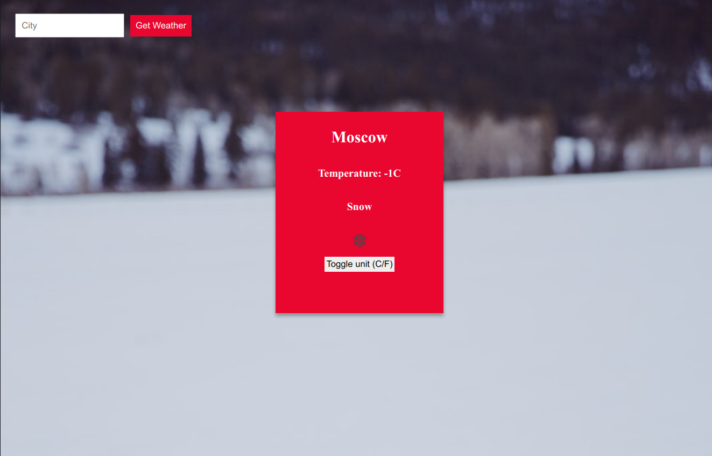

# Weather App (weather-app)

This is a mini-project that :

- Fetches weather for a specified city
- Displays temperature and weather description
- Allows the user to toggle between Celsius and Fahrenheit
- Displays a background image based on the weather



### Live Demo

[Live Demo Link](https://rawcdn.githack.com/newhorizon-tech/weather-app/85ced2620a683da0c84860b1ddf3baa618cd17fa/dist/index.html)

## Built With

- HTML/CSS
- Javascript
- NPM
- Webpack
- Atom


## Getting Started

- Clone the repository
- Navigate to the root directory of Weather App project
- Go to the 'dist' directory ```cd dist```.
- Open index.html or run it using your own live server

## API Key and Webpack compilation

If you want to modify and compile the project

- Create an account on OpenWeatherMap (https://openweathermap.org/)
- Create an API key (https://openweathermap.org/api)
- Navigate to the root directory of the Weather App
- Open ```env.js``` file and replace <API KEY> with the API key you created previously
- Run ```npm install``` to install dependencies
- Run  ```npm run build``` to compile/bundle the code or run ```npm run start``` to start the server

## Authors

👤 **Alaukik**

- Github: [@newhorizon-tech](https://github.com/newhorizon-tech)
- Twitter: [@techintosh3](https://twitter.com/techintosh3)


## Acknowledgements

- Unsplash
- OpenWeatherMap API
- The Odin project
- MDN Web Docs


## 🤝 Contributing

Contributions, issues, and feature requests are welcome!

Feel free to check the [issues page](https://github.com/newhorizon-tech/minimalist-restaurant-page/issues).

## Show your support

Give a ⭐️ if you like this project!
